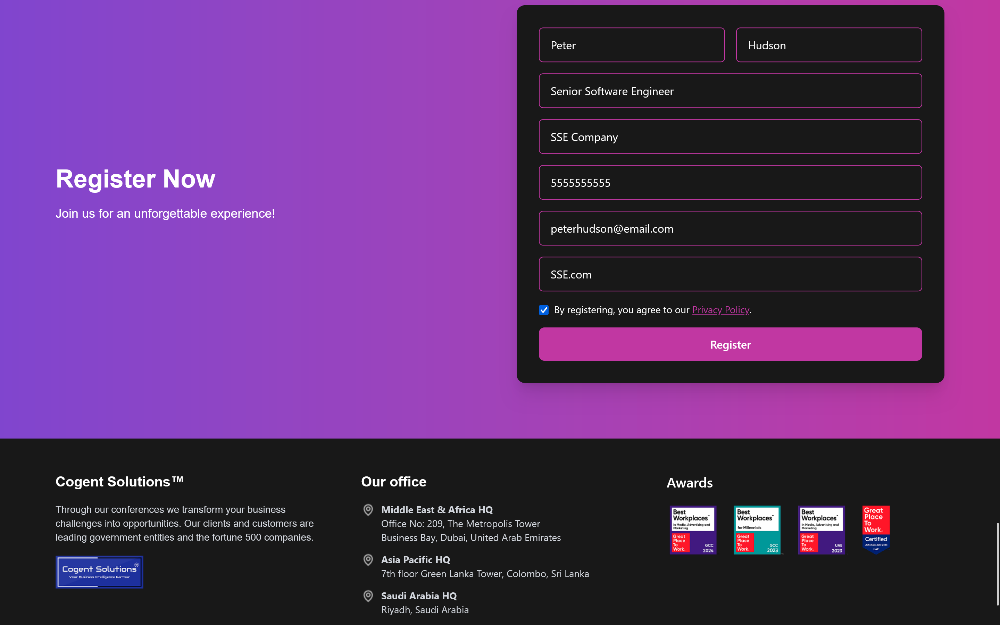
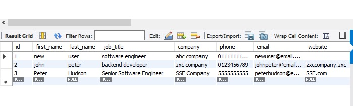
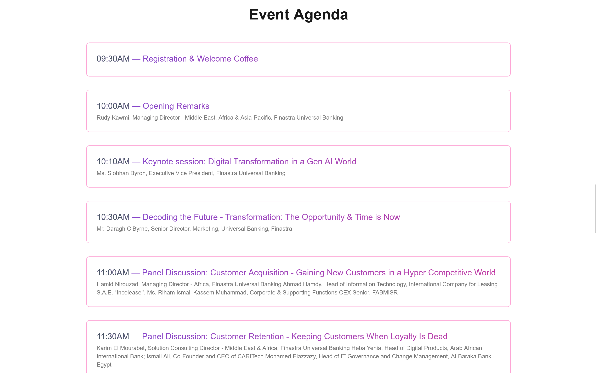
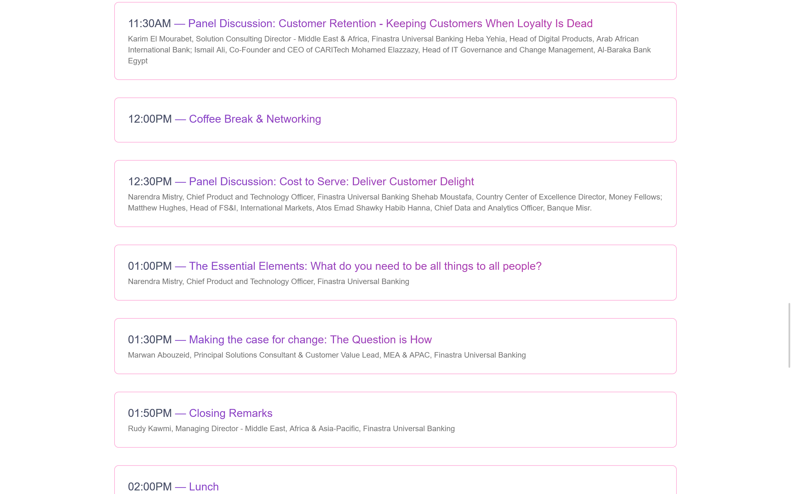
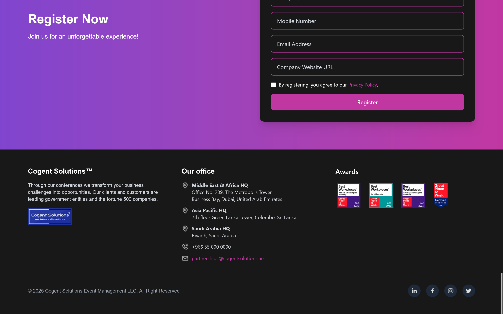

  <h1>Event Website</h1>
  

 

This is a Event Website with user registration section. 
 
built using:

<ul>
  <li>Frontend → React.js 
  - Tailwind CSS | Framer Motion
  </li>
  <li>Backend → Node.js</li>
  <li>Database → MySQL</li>
</ul>

<h2>1. Website Functionalities</h2>

<ul>
  <li><strong>Scroll Animations</strong> - Uses Framer Motion for scroll animations.</li>
  <li><strong>Registration Form</strong> - When a user enters registration details, they are saved to the database.</li>
</ul>

<h2>2. How to Start the website</h2>

<h3>Prerequisites</h3>
<ul>
  <li>React.js</li>
  <li>Node.js</li>
  <li>MySQL</li>
</ul>

<h3>2.1 Start Frontend (React.js)</h3>
<pre>
cd Client
cd events-website
npm install
npm run dev
</pre>

<h3>2.2 Start Backend (Node.js)</h3>
<pre>
cd Server
npm install
npx nodemon index.js
</pre>

<h3>2.3 Setup Database (MySQL)</h3>

<ol>
  <li>Create a new database in MySQL</li>
</ol>

<pre>
CREATE DATABASE event-app;
USE event-app;
</pre>

<ol start="2">
  <li>Create registrations table</li>
</ol>

<pre>
CREATE TABLE registrations (
  id INT AUTO_INCREMENT PRIMARY KEY,
  first_name VARCHAR(100),
  last_name VARCHAR(100),
  job_title VARCHAR(100),
  company VARCHAR(150),
  phone VARCHAR(20),
  email VARCHAR(150),
  website VARCHAR(200),
  created_at TIMESTAMP DEFAULT CURRENT_TIMESTAMP
);
</pre>

<h2>3. Website Demonstration</h2>

<h3>→ Register Form</h3>

The registeration section of the website

<h3>→ Database</h3>

Enter user details  Click <code>Register</code> button

<h2>4. Full website</h2>

